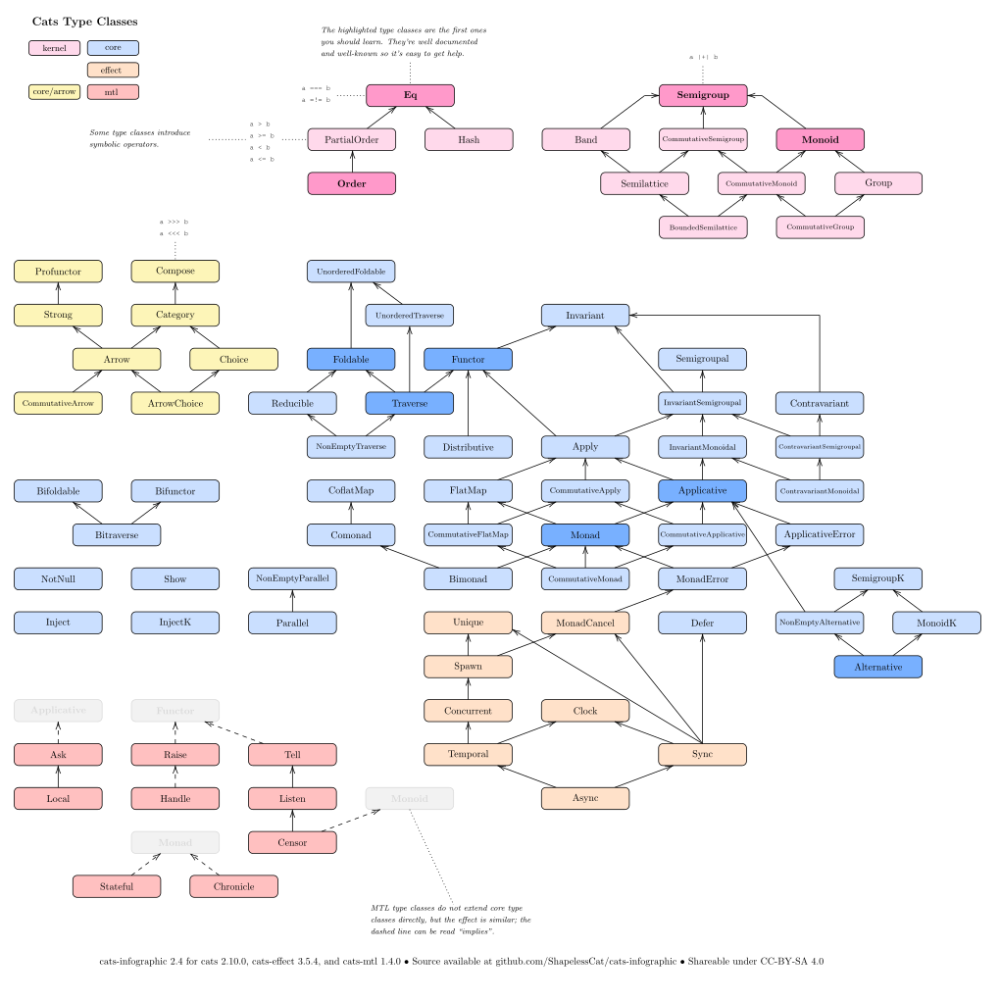

# Cats Infographic

cats-infographic 2 is diagram that shows the typeclass hierarchy for **cats 2.13.0**, **cats-effect 3.5.7**, and **cats-mtl 1.5.0**.

**TODO**: Need better fonts, font sizes, and maybe better layout, .svg version background should be opaque.

In the upstream repository [tpolecat/cats-infographic](https://github.com/tpolecat/cats-infographic),
Rob Norris ([tpolecat](https://github.com/tpolecat)) created the diagram with [*OmniGraffle*](https://www.omnigroup.com/omnigraffle).
*OmniGraffle* is not free, and people can't help to maintain and update the diagram without buying/subscribing *OmniGraffle*.
This is why I created my up-to-date version of cats-infographic with the free online tool [mathcha](https://www.mathcha.io), and then output a *LaTeX* file.

People who want to contribute can load the [cats-infographic.mathcha](./cats-infographic.mathcha) file with [mathcha](https://www.mathcha.io)
and edit the diagram directly. People who want to polish details can edit the [cats-infographic.tex](./cats-infographic.tex) file.

I put the upstream files in the [old](old/) folder. Both the new and old diagrams in this repository are shareable under the [CC-BY-SA 4.0](https://creativecommons.org/licenses/by-sa/4.0/) license.

The `.pdf` export, suitable for framing or tattoo design, is probably what you want.

The `.svg` export below is embiggenable with a gentle click.

